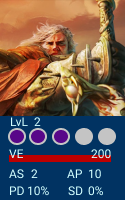
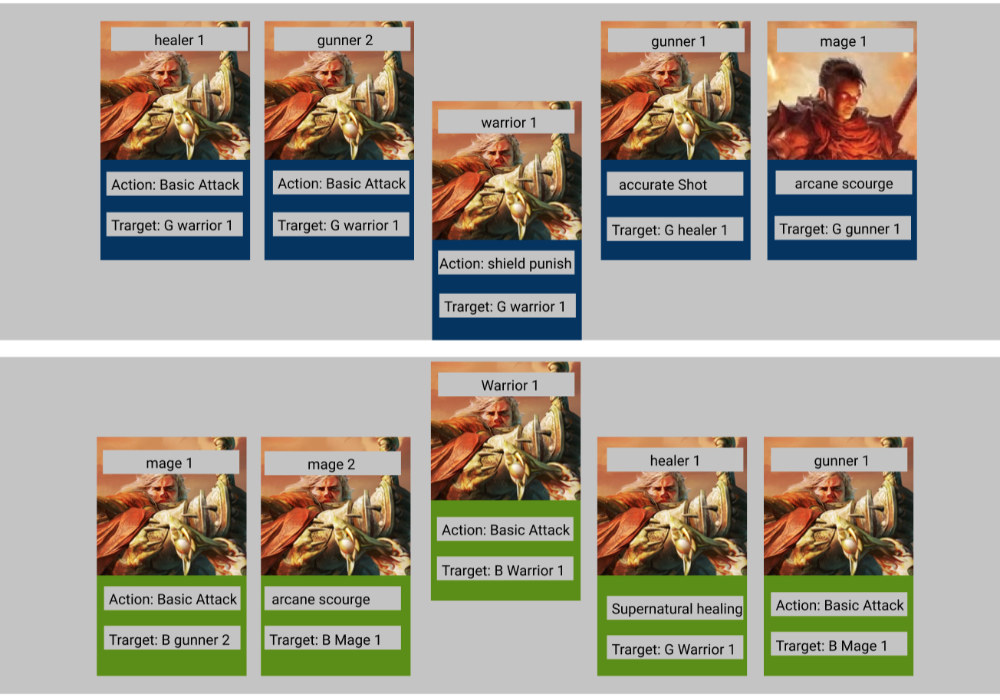

## TABLE OF CONTENTS
- [Game Progression](#game-progression)
  - [Stats](#stats)
  - [Classes](#classes)
- [Economy](#game-economy)
- [Items](#items)
- [Combat](#combat)


# My Adventuring Party

Game Overview
Game Concept
Genre
Target Audience
Game Flow Summary – How does the player move through the game.   Both through framing interface and the game itself.
Look and Feel – What is the basic look and feel of the game?  What is the visual style?
Gameplay and  Mechanics

---

# Game Progression <a id="game-progression"></a>

The game progress as the diferent HELDEN on the team grow whit level, and also the player have accses to more resources because of the expedition and the treasure droped by bigger opponents.

each HELDEN on the first version of the game can get levels until lvl 10 that is the cap for this version, after that the HELDEN can get more stats but the cap on his stats is permanent.

When a Helden get a new level all his skills get a small boost however the real power remain on the augmented cap of skill sets that unlock. see([Helden](#helden))


---

Mission/challenge Structure
Puzzle Structure
Objectives – What are the objectives of the game?
Play Flow – How does the game flow for the game player
Mechanics – What are the rules to the game, both implicit and explicit.  This is the model of the universe that the game works under.

---
# Game Mechanics 

## HELDEN <a id="helden"></a>



### HELDEN Leveling Up

Each HELDEN begin the adventure on LVL 1 and whit the same amount of base skill Stats, this base skill Stats are different for each class.

The different stats of a helden will grow with each leveling up, despite of that some stats growth are controled by the player and others dont.

the player can control how the skill battle stats of the HELDEN grow, for that he or her have two ways to enhance the skill stat of each HELDEN. **stats enhancer cookies** ([see here](#enhancer-items)) and **expeditions** ([see here](#expeditions)).

Each helden can have only a maximum of five stat enhancments by level, after each enhancement he or her will gain one experience shard, the experiences Shards reset on each level.

after a leveling up the next changes will happen:

1. The maximum amount of stats for each skill stat will be upgraded
1. All the skill Stats will be slightly bumped up (some stats will have an extra increment by class )
1. on lvl 3 / 7 / 10 the HELDEN will get a new SA slot AND A VE BOOST
1. after lvl 7 the HELDEN can be transform into SOUL STONES (NON a feature for UPLeveled final)

|lvl  | skill stats increment   | total SA slots | can be stoned? LOL|
|:----|:-----------------------:|:---------------|:-----------------:| 
|2    | 5%    + class increment | 2              | NO                |
|3    | 10% + 5%VE + class incr | 3              | NO                |
|4    | 10%   + class increment | 3              | NO                |
|5    | 10%   + class increment | 3              | NO                |
|6    | 10%   + class increment | 3              | NO                |
|7    | 15% + 10%VE + class inc | 4              | YES               |
|8    | 15%   + class increment | 4              | YES               |
|9    | 15%   + class increment | 4              | YES               |
|10   | 20% + 40%VE + class inc | 5              | YES but... REALLY?|


### Stats <a id="stats"></a>

each helden have his own set of stats, however not all the stats can be controled by the player this means there are two different kind of stats:

  - Hard Stats: This stats are fixed on the HELDEN they grow whit the rules of the game and the player cannot modify them directly.

    - Level(LvL): Represents the power of the HELDEN, despite each HELDEN grow on his o her own peace on average a HELDEN whit more level is powerfull.

    - Experiences Shards (ExS): Represent the amount of stats enhancements that a HELDEN have performed for his or her actual LvL, each HELDEN can have five enchancements per Level.

    - Special Actions (SA):  how many Special Actions can the HELDEN perform on one battle (this grow whit level).

    - Damage Nature: This is the type of damage that the HELDEN cause, this is determinated by class. there are two posible damage nature types, physical(warrior and gunner), supernatural(mage and healer)

    - Battle position: this stat is only relevant for battle and is determinated by class. All classes are ranged with exeption the warrior that is melee.

  - Skill Stats: this stats can be modified by the player and are part of the strategy of the player, meaning two different HELDEN can have the same lvl and class but be totally different. (ie, strong against soul damage, or with an insane amount of VP).

    - Vital Energy (VE):  Damage able to handle before be Unconcious.

    - Action Points (AP): Base number used to calculate the amount of points his or her actions cause.(ie. how much heal or how much damage cause whit his basic atack).

    - supernatural Defense (SD): percentage of probability to negate the damage of this type (this stat have a hard cap of 30 what means 30% and should be rarely upgraded)

    - physical Defense (PD): percentage of probability to negate the damage of this type (this stat have a hard cap of 30 what means 30% and should be rarely upgraded)


## Stats Cap

All the stats for a HELDEN have a cap based on his or her lvl:

|lvl  | VE    | AP   |   SD and PD           |
|:----|:-----:|:-----|:---------------------:| 
|1    |100    | 15   |   base +2             |
|2    |200    | 25   | init value +2         |
|3    |350    | 40   | init value +4 HARD 30 |
|4    |600    | 75   | init value +4 HARD 30 |
|5    |1000   | 130  | init value +4 HARD 30 |
|6    |2000   | 230  | init value +4 HARD 30 |
|7    |4000   | 430  | hard 30               |
|8    |7500   | 780  | hard 30               |
|9    |13000  | 1400 | hard 30               |
|10   |35000  | 4000 | hard 30               |

!!!!!!!!!!!

cada nivel tiene un maximo de expedisiones o cookies a las que puede ser mandado un helden. (esto quiere decir que los helden crecen de manera distinta dependiendo las cookies que se gasten en ellos, por otro lado los helden que se armen una vez se hallan desbloqueado las cookies mas poderozas pueden ser crecidos mejor lo que aumenta la rejugabilidad)

!!!!!!!!!

### Classes <a id="classes"></a>

On the game each class show the especiality if the HELDEN, each class have a uniqui Special Action, damage nature and base stats, also some of the skill sets evolve different on each class trought lvls.

  - Warrior:

    This HELDEN is phisicaly stronger as any other counterparts, he is the frontline figther of the party and is the only member capable to fight on melee range. He can recieve more damage before being defeated. Unfortunatly he cannot cause a lot of damage by himself.

    - ability proggression:
    each level, the warrior get an aditional 2% boost on VE

    - Unique conditions: This is the only Class that can be on hte first lane position (see Combat)

    - Special Hability: shield punish
      cost: 1 Special Action
      effect: 1.5 times ap damage to the target (melee)


  - Gunner:

    This HELDEN is faster and more agile than any other counterpart, he is able to use long distance weapons and pistols to cause a lot of physical damage to his opponents, he feels better fighting from a distance. It is not capable of withstanding much damage, but it can cause serious physical injury.

    - ability proggression:
    Each level, the Gunner get an aditional 2% boost on AP

    - Unique conditions: This is the class whit most physical damage potential.

    - Special Hability: accurate shot
      cost: 1 Special Action
      effect: 2 times ap physical damage to the target (range)

  - Mage:

    This HELDEN has the unique ability to use the magical energy that emanates from this new world, it is not really difficult to beat when alone, but you have to worry about the amount of magic damage it can cause when covered by an ally.

  - ability proggression:
    Each level, the Gunner get an aditional 2% boost on AP

    - Unique conditions: This is the class whit most Supernatural damage potential.

    - Special Hability: arcane scourge
      cost: 1 Special Action
      effect: 2 times ap supernatural damage to the target (range)

  - Healer:

    This HELDEN is not capable of killing anyone by himself, the amount of damage caused by him is the least of all the other counterparts, however he has the unique ability to heal with his magic power, and this is something that will mark the difference in battle.

  - ability proggression:
    Each level, the Gunner get an aditional 1 point boost on PD and SD in addition to 1% boost on AP

    - Unique conditions: This is the nly class that have the ability to.

    - Special Hability: supernatural healing
      cost: 1 Special Action
      effect: 2.5 times ap healing


#### Base Stats by Class

|Stat NAME  | Warrior  | Mage   | Gunner     | Healer       |
|:----------|:--------:|:-------|:----------:|-------------:| 
|VE         | 80       | 60     | 60         |   50         |
|AP         | 10       | 10     | 10         |   10         |
|SD         | 15       | 20     | 0          |   10         |
|PD         | 15       | 0      | 20         |   10         |


### Expeditions <a id="expeditions"></a>

(the cookies have to be a way to push the boundries of the HELDEN)

Expeditions are the usual way a HELDEN grow, in thouse the HELDEN go for a training during a period of time, and when he came back he get some stats enhancements. The enhancements that expedition gives allow the HELDEN grow in a balanced way, and sometimes give more bonuces as a normal enhancement cookie.

The more lvl have the HELDEN more time would be the duration of the expedition. send a HELDEN into expedition cost some gold based on the level of the HELDEN.

After the completion of the expedition the helden would get an Experience Slot filled (after 5 the HELDEN will Lvl Up).

After 5th expedition on a lvl 10 the HELDEN cannot go into expedition anymore (he is an ELDER he dont need to train!!)

The player begin with the ability to send only one HELDEN into expedition at time, he can Unlock 3 more slots with gold and the last with SoulStones.

1rst Slot : free
2nd Slot : 1000
3rd Slot : $10000
4rth Slot : $100000
5rth Slot : §200 

Expedition lvl |mins | hours | aprox. duration for level  | cost  |
|:-------------|:---:|:------|:--------------------------:|------:| 
1              |1    | 0     |  5 mins                    | 20    |
2              |8    | 0.1   |  40 min                    | 80    |
3              |27   | 0.5   |  2  hrs 15 min             | 250   |
4              |64   | 1.1   |  5  hrs 20 min             | 600   |
5              |125  | 2.1   |  10 hrs 25 min             | 1500  |
6              |216  | 3.6   |  18 hrs                    | 3000  |
7              |343  | 5.7   |  1 day 4 hrs 30 min        | 5000  |
8              |512  | 8.5   |  1 day 18 hrs              | 10000 |
9              |729  | 12.2  |  2 days 12 hrs             | 25000 |
10             |1000 | 16.7  |  3 days 12 hrs             | 45000 |   


**around 11 days for HELDEN to be lvl 10 without cookies**

The expedition have some probabilities to grow each of  VE and AP stats, DP and SP share the same grow slot by a 50% probability(expedition will grow one of them but not both) each HELDEN have 3 probabilites to grant a boost, if all fail dont grant any boost. each class have a primary stat that give 100% on the least increment.

Common increment: 80% of the time (100% on the primary stat )
Uncommon increment: 50% of the time
Rare increment: 10% of the time

for each of VE and AP the system check if a Rare increment will occur. If that happens dont check any other. if the check fails
go for the next one.

for DP and SP, the system first check which stat will be incremented, then check if the rare increment will occur, if the check fail go to the next one and so on.


|Stat NAME  | Warrior         | Mage  (AP)      | Gunner    (AP) |Healer(SD and PD)|
|:----------|:---------------:|:----------------|:--------------:|----------------:| 
|VE         | 5% / 8% / 10%   | 1% / 5% / 8%    | 1% / 5% / 8%   | 0% / 2% / 5%    |
|AP         | 1% / 5% / 8%    | 5% / 8% / 10%   | 5% / 8% / 10%  | 5% / 5% / 10%   |
|SD         | 0  / 1  / 1     | 0  / 1  / 1     | 0  / 0  / 1    | 1  / 1  / 2     |
|PD         | 0  / 1  / 1     | 0  / 0  / 1     | 0  / 1  / 1    | 1  / 1  / 2     |


Movement in the game
Objects – how to pick them up and move them 
Actions, including whatever switches and buttons are used, interacting with objects, and what means of communication are used
Combat – If there is combat or even conflict, how is this specifically modeled?

# Combat Phase <a id="combat"></a>


```
NOTES: 
1 TURN / MINUTE
BATTLES BETWEEN 4-6MIN   EXTENSIBLE UNTIL 6-10 MINUTES   NO LONGER THAN 15 MIN
```

The battle phase is where the action takes place, this is what makes My Adventure Party and strategy game. Here each of the parts involve on the battle would take turns to perform actions that would define the results of the battle.

Each player would decide in between different turns which actions to perform, the turn itself have some steps wich makes the strategic part of the game taking place.

when a HELDEN or creature (character), lose all his VE fall unconcious and cannot battle any more

the first player on make all opponent player unconcious win the combat.

If after 10 rounds the combat have not a winner, the VE of all standing characters is divided by:

turn 11 :  4	
turn 12 :  16	
turn 13 :  64	
turn 14 :  256	
turn 15 :  1024
... still alive!!!!
turn 16 : draw...

on a draw no player get rewards.

## Combat Actions: 

there are Two types of actions on my Adventure Party Combat, **Tactical** and **Damaging**:

  - Tactical Actions: are actions that dont cause damage to the Characters on combat, things as healing, revive, or rasing defenses.
  - Damaging Actions: are as named, actions that deal damage to a target.

- each turn of the combat have 3 steps:

Pre: only tactical Actions can be performed
damage: only Damaging Actions can be performed
post: only Tactical Actions can be performed

Each of this steps are resolve in order, first tactical actions that where targeted as pre, will be performed, then the damage actions
and last all the post actions (if the target of an action is unconcious at the moment of the post action resolution, the action will be skipped).

- pre and post: when a player is declaring actions if the action is a tactical action he or she have to declare if wanted to resolve pre or post damage.

- damage: all the damage will be applied at the same time, that means that even if a character die as result of the damage, he will cause damage with his attack.

## characther actions

On each turn each HELDEN or Creature can perform one of the following actions:

- Basic Attack: (is allways a damagin action)
Damage based on his AP.

- Special Action: (can be a tactic action or a damagin action)
Class Abilitity of the helden or creature. (can only perform the ability if have one SA avaliable)

- Battle item:
Battle item usage. (is allways a tactic action)

Each of this action need a target and if is a tactical action need a timing trigger (pre or post).

## Damage resolution

For each damaging action performed the game should preform at least 1 damage attempt, to decide if the damaged is applied or resisted.

the algoritm to perform is the following:

1. determinate if the damage nature of the performer of the damaging action
1. determinate the defense of the target for the damaging nature of the performer
1. determinate if the damage will be resisted or not based on the defense (the damage should be resisted un porcentage of times equals to the defense value of the target.).
1. apply damage if needed.


## Combat positions



At the begining of the combat, the screen show the two opposite teams one on front of the other in one horizontal way, the warriors are positionated a little bit towards the middle.

there are two positions on the combat, **the front Line position** and the **covered position**

this positions are important for the damage resolution.

Every time one action have as target a character on a covered position, if there is at least one character alive on the front line of the same team as the target, the action is splited into two damage Attempts, one for the target and one for the melee character on the front line.

if one of thouse result in a success the damage dealt is the half of the total damage attempt.

if there are no more concious melee character on the target character team there is only one damage Attempt for the hole damage.


---

# Economy <a id="game-economy"></a>

In the geame there are two diffenrent type of currencies:

- $ GOLD
- § SOUL STONES

## GOLD: 

The gold on My Adventuring Party is the economy resource of the game. With this the player can buy items that allow him or her improve his or her team, or perform some actions on battle. The gold not only is used to buy items but, can be used to buy extra features as extra **HELDEN** slots or exceed the daily maximum battle encounters amount.

<br>

### How to Get gold

El jugador inicia el juego con $500 y un maximo de $1000, el limite maximo de oro puede ser aumentado por medio de SOUL STONES.

Aunque el jugador obtiene oro por medio de misiones y batallas tambien obtiene oro a traves de el tiempo hasta que llena su contenedor de ganancia ocacional, el cual debe vaciar con un click. 

<br>

  - Recurrent Gold Container

    el ratio de ganancia ocacional de oro sobre el tiempo se mantiene igual durante todo el juego a:

    $1 / 40 sec ($90/hour)

    | Gold container lvl   | Gold cap       | lvlUp cost |
    |:---------------------|:---------------|:-----------|
    | 0                    | $100           | ---        | 
    | 1                    | $500           | §5         | 
    | 2                    | $800           | §8         | 
    | 3                    | $1200          | §12        | 

<br>

  - Gold from Battle Encounter:

    The bigest source of gold came from battles the player would have some reward after each encounter that finish as a victory, the player dont gain anithyng for a fail encounter. the amount of gold founded on the battle will be based on the level of the enemy defeated.

    | Enemy defeated lvl |    single enemy     | party Gold drop rate     |
    |:------------------ |:--------------------|:-------------------------|
    | 1                  |         $5-20       | $20    -  $100           |
    | 2                  |        -->/5        | $50    -  $200           |
    | 3                  |        -->/5        | $100   -  $500           |
    | 4                  |        -->/5        | $250   -  $1000          |
    | 5                  |        -->/5        | $500   -  $2000          |
    | 6                  |        -->/5        | $1000  -  $4000          |
    | 7                  |        -->/5        | $2000  -  $6000          |
    | 8                  |        -->/5        | $3000  -  $10000         |
    | 9                  |        -->/5        | $5000  -  $12000         |
    | 10                 |        -->/5        | $6000  -  $15000         |

    The enemies on the world have different rarities, this rarities make easier to them to drop more gold at the end of encounter.

    | Enemy rarity   | doble up gold rate|
    |:---------------|:------------------|
    |Common          |1%                 |
    |Uncommon        |10%                |
    |Rare            |50%                |

## SOUL STONES: 

The SOUL STONES on My Adventuring Party are the most rare resource. With this resource the player can get special items and unlock special game features. Is also well known that when a HELDEN reach level 10 each level will have an aditional Soul Stone Requirement.

<br>

### How to SOUL STONES

The player begins whit 5 SOUL STONES but he will not get anymore for free over the time. The SOUL STONES will only avaliable as rare reward from victory encounters.

<br>


  - SOUL STONES from Battle Encounter:

    The probability of a SOUL STONE to be founded on the battle will be based on the level of the enemy defeated.

    | Enemy defeated lvl   | SOUL STONE PROBABILITY    |
    |:---------------------|:--------------------------|
    | 1 - 5                | 0.001%                    |
    | 6                    | 0.5%                      |
    | 7                    | 1%                        |
    | 8                    | 1.5%                      |
    | 9                    | 1.8%                      |
    | 10                   | 2%                        |

    The enemies on the world have different rarities, this rarities make easier or harder to them to drop SOUL STONES at the end of encounter.

    | Enemy rarity   | drop modifier              |
    |:---------------|:---------------------------|
    |Common          |his level probabilry x 0.5  |
    |Uncommon        |his level probabilry x 1    |
    |Rare            |his level probabilry x 2    |

---

# Items <a id="items"></a>

Items are comodities the player recieve as reward from battle and can buy from he nomadic merchant on the management phase page. whit thouse the player not only make his helden stronger, but also some of thouse allow him to perform some special actions on the battle phase.

## DROP RATE

Despite all items can be buyed form the merchant (some of thouse until unlock it), there are also some of thouse that can be dropped from encounters each item have his own drop rate based on his rarity. the drop rates for the items are:


  - Common Items

    | Enemy defeated lvl   | drop probability          |
    |:---------------------|:--------------------------|
    | 1 - 5                | 5%                        |
    | 6                    | 10%                       |
    | 7                    | 20%                       |
    | 8                    | 30%                       |
    | 9                    | 40%                       |
    | 10                   | 50%                       |

  - Uncommon Items

    | Enemy defeated lvl   | drop probability          |
    |:---------------------|:--------------------------|
    | 1 - 5                | 2%                        |
    | 6                    | 4%                        |
    | 7                    | 8%                        |
    | 8                    | 16%                       |
    | 9                    | 30%                       |
    | 10                   | 40%                       |


  - Rare Items

    | Enemy defeated lvl   | drop probability          |
    |:---------------------|:--------------------------|
    | 1 - 5                | 1%                        |
    | 6                    | 2%                        |
    | 7                    | 4%                        |
    | 8                    | 8%                        |
    | 9                    | 16%                       |
    | 10                   | 30%                       |

  - Phantom Items

    | Enemy defeated lvl   | drop probability          |
    |:---------------------|:--------------------------|
    | 1 - 5                | 0.001%                     |
    | 6                    | 0.5%                      |
    | 7                    | 1%                        |
    | 8                    | 1.5%                      |
    | 9                    | 1.8%                      |
    | 10                   | 2%                        |


    The enemies on the world have different rarities, this rarities make easier or harder to them to drop ITEMS at the end of encounter.

    | Enemy rarity   | drop modifier              |
    |:---------------|:---------------------------|
    |Common          |his level probabilry x 0.5  |
    |Uncommon        |his level probabilry x 1    |
    |Rare            |his level probabilry x 2    |


Items on the game are divided on **BATTLE ITEMS** and **ENHANCER ITEMS**:

## ENHANCER ITEMS and POWERUPS <a id="enhancer-items"></a>

This are powerups that allow the player unlock features, or apply enchancements to his HELDEN party members, some of thouse allow the HELDEN came back faster from the deafeated state, or just speed up some timers on the game. Usually this items are used on the party managment phase of the game.

 - LIST OF ENHANCER POWERUPS:

    + Restore Potion: As his name indicates allow one Helden came back from the deafeated state. (estado en el cual quedan los HELDEN al perder una batalla o no poder luchar mas... por decidir)
        - price: $1000 - §1
        - rarity: Uncommon
    + Restore Party Potion: allow the full active Helden party came back from the deafeated state. (estado en el cual quedan los HELDEN al perder una batalla o no poder luchar mas... por decidir)
        - price: $5000 - §3
        - rarity: Rare
    + Stat Enhancer cookie/milk: This item allow the player enchance some points on one stat of one helden, there are different versions of this cookie. After some especific amount of cookies _(3-5 por definir)_ the helden cannot eat more of thouse until a level Upgrade.
      + Enhancer cookie : give +10% on one of stat between(VE or AP), fill one cookie slot
        - price: $10000
        - rarity: Rare
      + Enhancer milk : give of stat +4 (PD or SD)
        - price: $10000
        - rarity: Rare
      + Phantom cookie  + 2 : give +8% on one stat, DONT USE ANY Experience SLOT
        - price: $200000 (HAVE TO BE UNLOCKED WHIT SOUL STONES) - §20
        - rarity: Phantom

---

_Fuera de prototipo up leveled
queso de aumento de item rate: aumenta el drop rate por un cierto tiempo (C, U , R)
polvo cambia clase: permite cambiar la clase de un HELDEN con todos sus stats intactos.
cambia habilidad: permite hacer un swap entre dos skill stats_


---


## BATTLE ITEMS

This are items that allow the player perform actions on combat, this items are also founded from battles.

 - LIST OF BATTLE ITEMS:

    + Healing Potion: As his name indicates heal some of the points lost on battle. there are different versions of this potion.
      + basic Potion: give back 20% of the health (sould be able to heal more or less 2 basic atacks from an average mage or gunner of the same level).
        - price: $20
        - rarity: Common
      + royal Potion: give back 50% of the health.
        - price: $80
        - rarity: Uncommon
      + Nova Potion: restore full health.
        - price: $120
        - rarity: Rare
      + Phantom potion: restore 50% of the health for the hole Team (they have to be active on battle)
        - price: $500 (HAVE TO BE UNLOCKED WHIT SOUL STONES) - §1
        - rarity: Phantom
    + Special ability rejuvinator: This item allow HELDEN to have active again some of his special points which allow use again his or her class power ability. there are different versions of this rejuvinator. 
      + rejuvinator: give back all the special ability points on a HELDEN.
        - price: $200
        - rarity: rare
      + Phantom rejuvinator:  give back all the special ability points on all party HELDEN (they have to be active on battle).
        - price: $1000 (HAVE TO BE UNLOCKED WHIT SOUL STONES) - §2
        - rarity: Phantom

---

_Fuera de prototipo up leveled
aumentadores de base de ataque
aumentadores de resistencia (fisica o magica)
aumentadores de drop rate(lanzado sobre un enemigo)
piro piedras (items que causan daño magico)
bombardas (items que causan daño fisico)_

---

Screen Flow -- A graphical description of how each screen is related to every other and a description of the purpose of each screen.
Game Options – What are the options and how do they affect game play and mechanics?
Replaying and Saving 
Cheats and Easter Eggs
Story, Setting and Character  
Story and Narrative – Includes back story, plot elements, game progression, and cut scenes.  Cut scenes descriptions include the actors, the setting, and the storyboard or script.
Game World
General look and feel of world
Areas, including the general description and physical characteristics as well as how it relates to the rest of the world (what levels use it, how it connects to other areas)
Characters.  Each character should include the back story, personality, appearance, animations, abilities, relevance to the story and relationship to other characters 
Levels
Levels.  Each level should include a synopsis, the required introductory material (and how it is provided), the objectives, and the details of what happens in the level.  Depending on the game, this may include the physical description of the map, the critical path that the player needs to take, and what encounters are important or incidental.
Training Level
Interface
Visual System.  If you have a HUD, what is on it?  What menus are you displaying? What is the camera model?
Control System – How does the game player control the game?   What are the specific commands?
Audio, music, sound effects
Help System
Artificial Intelligence
Opponent  and Enemy AI – The active opponent that plays against the game player and therefore requires strategic decision making 
Non-combat and Friendly Characters
Support AI -- Player and Collision Detection, Pathfinding
Technical 
Target Hardware
Development hardware and software, including Game Engine
Network requirements
Game Art – Key assets, how they are being developed.  Intended style.


— Acciones posibles en combate:

Ataque basico:

todos los personajes pueden hacer un ataque básico de tipo basado en su clase (ejemplo un warrior hace un ataque melee, un mago hace un ataque rango), el dano del ataque básico es = a los puntos base de acción x nivel.
